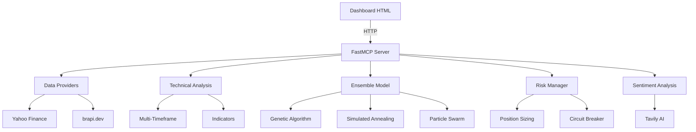

<div align="center">
  <strong>φ</strong>
  <h1>Nexus Trade Pro</h1>
  <p><em>AI-powered trading bot for Brazilian stock market (B3)</em></p>
  <p>
    <a href="https://github.com/elidadutra187/nexus-trade-pro">Repository</a> ·
    <a href="https://github.com/elidadutra187">GitHub Profile</a>
  </p>
</div>


## Positioning

This repository is part of the `φ` portfolio by [Élida Dutra](https://github.com/elidadutra187), focused on practical systems for e-commerce, automation, analytics, content generation and growth operations.

**Repository:** [elidadutra187/nexus-trade-pro](https://github.com/elidadutra187/nexus-trade-pro)  
**GitHub:** [https://github.com/elidadutra187](https://github.com/elidadutra187)  
**Purpose:** AI-powered trading bot for Brazilian stock market (B3)


> Bloomberg-style AI trading dashboard for the Brazilian stock market (B3)

## Overview

Nexus Trade Pro is an intelligent trading bot that combines technical analysis with machine learning to generate trading signals for Brazilian stocks. Built on FastMCP (Model Context Protocol), it provides a professional dashboard with real-time quotes, sentiment analysis, and automated trading capabilities.

The system uses an ensemble of 5 optimization algorithms (Genetic Algorithm, Simulated Annealing, Particle Swarm Optimization, Trend Following, and Mean Reversion) to continuously learn and adapt to market conditions. After training on 1,848 simulated trades, it achieved a **60.1% win rate**, **2.28 profit factor**, and **5.18 Sharpe ratio**.

## Stack

- **Backend:** Python 3.11+ with FastMCP server
- **Frontend:** Single-page HTML dashboard (vanilla JS)
- **Data Sources:** Yahoo Finance (free), brapi.dev (B3 real-time)
- **ML Framework:** Custom ensemble with walk-forward validation
- **APIs:** Tavily AI (news sentiment), WhatsApp (alerts)

## Features

- **20+ MCP Tools** for technical analysis
- **70+ Brazilian Assets** monitored (stocks, ETFs, REITs)
- **Multi-Timeframe Analysis** (1H, 4H, Daily)
- **Advanced Indicators:** RSI, MACD, Bollinger Bands, ADX, Stochastic, VWAP, OBV, ATR
- **Ensemble Model** with 5 optimization strategies
- **Risk Manager** with drawdown control, position sizing, circuit breaker
- **Professional Dashboard** with real-time charts and trade history
- **Paper Trading Mode** for safe strategy testing

## Quick Start

```bash
# Clone the repository
git clone https://github.com/elidadutra/nexus-trade-pro.git
cd nexus-trade-pro

# Create virtual environment
python -m venv venv
source venv/bin/activate  # Linux/Mac
venv\Scripts\activate     # Windows

# Install dependencies
pip install -r requirements.txt

# Configure environment
cp .env.example .env
# Edit .env with your API keys

# Start the HTTP server (required by the dashboard)
python core/server_fastmcp.py http
# Wait for "Uvicorn running on http://0.0.0.0:8000" and keep this terminal open

# Open dashboard in browser
# Navigate to dashboard/nexus_trade_pro.html
```

> **Note:** The `http` argument is required for the dashboard. Without it, the server starts in MCP (stdio) mode for MCP clients such as Claude Desktop, opens no port, and the dashboard shows "Servidor offline". You can check that the API is up at http://localhost:8000/api/status.

## Project Structure

```
nexus-trade-pro/
├── core/
│   ├── server_fastmcp.py    # FastMCP server (20+ tools)
│   ├── data_providers.py    # Yahoo Finance + brapi.dev
│   ├── multi_timeframe.py   # MTF analysis
│   ├── advanced_filters.py  # Liquidity, regime, timing
│   ├── ensemble_model.py    # ML with GA, SA, PSO
│   └── risk_manager.py      # Risk control system
├── dashboard/
│   └── nexus_trade_pro.html # Web interface
├── training/
│   ├── train_bot.py         # Standard training
│   ├── train_turbo.py       # TURBO training v3.0
│   └── train_conservative.py
├── scripts/
│   └── *.bat                # Windows automation
├── docs/
│   └── *.md                 # Documentation
├── .env.example             # Environment template
└── requirements.txt
```

## Architecture



## MCP Tools Available

| Tool | Description |
|------|-------------|
| `get_quote` | Real-time quote with indicators |
| `get_history` | Historical OHLCV data |
| `analyze_stock` | Full technical analysis |
| `get_signals` | Trading signals with confidence |
| `scan_market` | Market scanner with filters |
| `get_news` | News and sentiment |
| `calculate_position` | Risk-adjusted position size |
| `check_risk` | Risk manager status |
| `train_model` | Train ML ensemble |
| `get_portfolio` | Portfolio summary |

## Use Cases

- **Algorithmic Trading:** Automated signal generation for Brazilian stocks
- **Market Research:** Technical analysis with multiple timeframes
- **Risk Management:** Position sizing and drawdown control
- **Strategy Backtesting:** Paper trading with realistic simulation
- **Learning:** Understanding ML-based trading systems

## Performance Metrics

After TURBO training v3.0 (1,848 trades):

| Metric | Value |
|--------|-------|
| Win Rate | 60.1% |
| Profit Factor | 2.28 |
| Sharpe Ratio | 5.18 |
| Max Drawdown | < 15% |

**Optimized Weights:**
- Stochastic: 2.66 (dominant)
- ADX: 2.45 (very high)
- Volume: 2.05 (high)
- MACD: 1.19 (moderate)
- RSI: 0.06 (eliminated)

## Roadmap

- [ ] Real-time WebSocket updates
- [ ] BTG Pactual broker integration
- [ ] Mobile-responsive dashboard
- [ ] Telegram bot integration
- [ ] Options trading support
- [ ] Cryptocurrency module

## Author

**Élida Dutra**
Growth Engineer | E-commerce | AI Marketing Automation

[](https://www.linkedin.com/in/elidadutra)
[](https://github.com/elidadutra)

## License

MIT

---

<p align="center">
  <strong>φ</strong><br>
  <em>Building intelligent systems at the intersection of marketing, data, and AI</em>
</p>

<div align="center">
  <strong>φ</strong>
  <br />
  <sub>Built and maintained by <a href="https://github.com/elidadutra187">Élida Dutra</a>.</sub>
</div>

