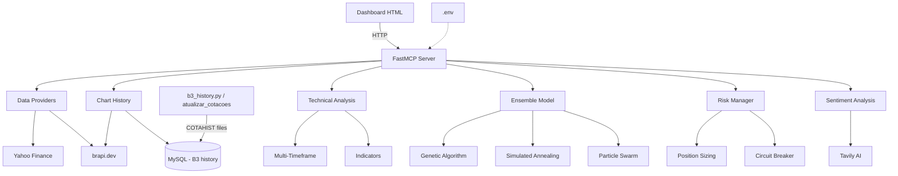

<div align="center">
  <strong>φ</strong>
  <h1>Nexus Trade Pro</h1>
  <p><em>AI-powered trading bot for Brazilian stock market (B3)</em></p>
  <p>
    <a href="https://github.com/elidadutra187/nexus-trade-pro">Repository</a> ·
    <a href="https://github.com/elidadutra187">GitHub Profile</a>
  </p>
</div>


## Positioning

This repository is part of the `φ` portfolio by [Élida Dutra](https://github.com/elidadutra187), focused on practical systems for e-commerce, automation, analytics, content generation and growth operations.

**Repository:** [elidadutra187/nexus-trade-pro](https://github.com/elidadutra187/nexus-trade-pro)  
**GitHub:** [https://github.com/elidadutra187](https://github.com/elidadutra187)  
**Purpose:** AI-powered trading bot for Brazilian stock market (B3)


> Bloomberg-style AI trading dashboard for the Brazilian stock market (B3)

## Overview

Nexus Trade Pro is an intelligent trading bot that combines technical analysis with machine learning to generate trading signals for Brazilian stocks. Built on FastMCP (Model Context Protocol), it provides a professional dashboard with real-time quotes, sentiment analysis, and automated trading capabilities.

The system uses an ensemble of 5 optimization algorithms (Genetic Algorithm, Simulated Annealing, Particle Swarm Optimization, Trend Following, and Mean Reversion) to continuously learn and adapt to market conditions. After training on 1,848 simulated trades, it achieved a **60.1% win rate**, **2.28 profit factor**, and **5.18 Sharpe ratio**.

## Stack

- **Backend:** Python 3.11+ (tested on 3.14) with FastMCP + FastAPI
- **Frontend:** Single-page HTML dashboard (vanilla JS, Chart.js 4), served by the backend
- **Market data:**
  - [brapi.dev](https://brapi.dev) — current quotes (free plan: ~30 min delay, 3 months of history)
  - **B3 official history** (COTAHIST files) stored in MySQL — daily candles for the charts
  - Yahoo Finance — fallback provider for the analysis modules
- **ML Framework:** Custom ensemble with walk-forward validation
- **APIs:** Tavily AI (news sentiment), WhatsApp (alerts, placeholder)

## Features

- **17 MCP Tools** and 50+ REST endpoints for technical analysis, risk and trading
- **90 Brazilian tickers** in the watchlist (stocks, ETFs, REITs, BDRs), with live/simulated tags
- **Market panel:** search by ticker or sector, favorites (★) pinned to the top, look up any ticker
- **Charts:** candlestick/line, daily, weekly, monthly and yearly candles (up to 5 years with the B3 history), value readout and tooltips in R$
- **Multi-Timeframe Analysis** (1H, 4H, Daily)
- **Advanced Indicators:** RSI, MACD, Bollinger Bands, ADX, Stochastic, VWAP, OBV, ATR
- **Ensemble Model** with 5 optimization strategies
- **Risk Manager** with drawdown control, position sizing, circuit breaker
- **Paper Trading Mode** for safe strategy testing
- **Single source of configuration:** everything is read from `.env` (API keys reload without restart)

## Getting Started (step by step)

### 0. Prerequisites

| Requirement | Notes |
|---|---|
| Python 3.11+ | `python3 --version` |
| Git | to clone the repository |
| brapi.dev account | free token at <https://brapi.dev/dashboard> (required for most tickers) |
| MySQL 5.7+ *(optional)* | only for the 5-year B3 history in the charts |
| Tavily key *(optional)* | news sentiment; without it the dashboard shows sample news |

### 1. Clone the repository

```bash
git clone https://github.com/elidadutra187/nexus-trade-pro.git
cd nexus-trade-pro
```

### 2. Create and activate a virtual environment

```bash
python3 -m venv venv
source venv/bin/activate        # Linux / macOS
venv\Scripts\activate           # Windows
```

Every command below assumes the virtual environment is active and the current directory is the project root.

### 3. Install the dependencies

```bash
pip install -r requirements.txt
```

### 4. Configure the `.env`

```bash
cp .env.example .env            # Windows: copy .env.example .env
```

Open `.env` and fill in at least:

| Variable | What to put |
|---|---|
| `BRAPI_TOKEN` | your brapi.dev token |
| `TAVILY_KEY` | *(optional)* your Tavily key |
| `DB_OLD_*` | *(optional)* MySQL host, port, database, user and password for the B3 history |

All other settings (capital, stop loss, take profit, max positions, trading hours, server port...) already have conservative defaults and are documented inside `.env.example`. The app always reads them from `.env`, which takes precedence over system environment variables.

> **Check your brapi token.** PETR4, VALE3, ITUB4 and MGLU3 work even without a token, so test with another ticker:
>
> ```bash
> curl -H "Authorization: Bearer YOUR_TOKEN" "https://brapi.dev/api/v2/stocks/quote?symbols=PETR3"
> ```
>
> A `401` response means the token is invalid or inactive — generate a new one in the brapi dashboard.

### 5. *(Optional)* Load the B3 history into MySQL

Without this step the charts use brapi, which on the free plan only covers the last 3 months.
With it, the charts show up to 5 years of official B3 daily data.

```bash
python3 core/b3_history.py --carga       # first load: ~6 min, ~1.45M rows, ~280 MB
python3 core/b3_history.py --status      # rows, tickers, first/last trading day
```

The tables (`bolsa_cotacoes_diarias`, `bolsa_arquivos_importados`) are created automatically in the database set in `DB_OLD_NAME`. Details: [docs/HISTORICO_B3.md](docs/HISTORICO_B3.md).

### 6. Start the server

```bash
python3 core/server_fastmcp.py http
```

Wait for the banner and `Uvicorn running on http://0.0.0.0:8000`, and keep this terminal open. The banner shows which integrations are active:

```
  brapi.dev: [OK]
  Tavily:    [OK]
  Hist. B3:  [OK] MySQL your-host      <- or "[X] (usando brapi)" without step 5
  Dashboard: http://localhost:8000/dashboard
```

> The `http` argument is required for the dashboard. Without it, the server starts in MCP (stdio) mode for MCP clients such as Claude Desktop, opens no port, and the dashboard shows "Servidor offline".

### 7. Open the dashboard

Go to **<http://localhost:8000/dashboard>** (use the port from `SERVER_PORT` if you changed it).

- **MERCADO** — quote cards (`LIVE` = real data, `SIM` = simulated fallback), search box and ★ favorites
- **GRAFICOS** — pick a ticker (favorites first) and a period; the readout shows the values and the data source
- **ANALISE**, **NOTICIAS**, **BOT PRO**, **APRENDIZADO**, **HISTORICO**, **PORTFOLIO**

### 8. Verify that everything is working

| Check | Expected |
|---|---|
| <http://localhost:8000/api/status> | `"brapi_configured": true` |
| <http://localhost:8000/api/quote/PETR3> | a price, not `"error"` (validates the brapi token) |
| <http://localhost:8000/api/config> | the values from your `.env` (capital, stop, take profit...) |
| <http://localhost:8000/api/chart/PETR4?range=5y&interval=1mo> | `"source": "B3"` (only with step 5) |

### 9. Keep the B3 history up to date

The server imports missing trading days on startup and every `B3_UPDATE_HOURS` hours. To update manually (e.g. with the server off):

```bash
scripts/atualizar_cotacoes.sh              # Linux/macOS - finds and imports missing days
scripts/atualizar_cotacoes.sh --verificar  # only lists what is missing
scripts\atualizar_cotacoes.bat             # Windows
```

B3 publishes each trading day around 23:30; run it at night or the next morning. Log: `logs/atualizar_cotacoes.log`.

### 10. *(Optional)* Automated trading and training

```bash
python3 core/auto_trader.py                  # forward test (simulated trades, logs in data/)
python3 training/train_conservative.py       # retrain weights with walk-forward validation
python3 training/test_broker_connection.py   # check MetaTrader 5 settings (MT5_* in .env)
```

On Windows there are shortcuts in `scripts/` (`iniciar_auto_trader.bat`, `treinar_conservador.bat`, `treinar_bot.bat`, `turbo_train.bat`). Read [docs/GUIA_INICIO_RAPIDO.md](docs/GUIA_INICIO_RAPIDO.md) before trading with real money.

### Troubleshooting

| Symptom | Cause / fix |
|---|---|
| Dashboard shows **Servidor offline** | Server not running, or started without `http` (step 6) |
| Cards tagged **SIM** instead of **LIVE** | brapi returned no data: invalid token, monthly quota reached, or delisted ticker |
| `Token de autenticação inválido ou inativo` | Invalid brapi token — see the check in step 4 |
| Chart error `endpoint /api/chart nao existe` | The running server is an older version — restart it |
| `O range "6mo" não está disponível no seu plano` | brapi free plan: load the B3 history (step 5) for periods longer than 3 months |
| Settings changed in `.env` not applied | API keys reload automatically; any other setting needs a server restart |
| `ModuleNotFoundError` | Virtual environment not active, or `pip install -r requirements.txt` not run |

## Project Structure

```
nexus-trade-pro/
├── core/
│   ├── server_fastmcp.py    # FastMCP + HTTP server (MCP tools, REST API, dashboard)
│   ├── env_config.py        # Settings from .env (auto-reload)
│   ├── b3_history.py        # Official B3 history (COTAHIST) -> MySQL
│   ├── data_providers.py    # Yahoo Finance + brapi.dev
│   ├── multi_timeframe.py   # MTF analysis
│   ├── advanced_filters.py  # Liquidity, regime, timing
│   ├── ensemble_model.py    # ML with GA, SA, PSO
│   ├── risk_manager.py      # Risk control system
│   ├── auto_trader.py       # Automated forward test / live trading loop
│   └── broker_integration.py# MetaTrader 5 / paper broker
├── dashboard/
│   └── nexus_trade_pro.html # Web interface (served at /dashboard)
├── training/                # Training scripts and connection tests
├── scripts/
│   ├── atualizar_cotacoes.sh / .bat   # Daily B3 history update
│   └── *.bat                # Windows shortcuts (auto trader, training)
├── sql/
│   └── bolsa_schema.sql     # MySQL tables for the B3 history
├── docs/
│   ├── HISTORICO_B3.md      # B3 history importer guide (reusable in other projects)
│   ├── GUIA_INICIO_RAPIDO.md# Forward test -> real trading guide
│   ├── MELHORIAS_URGENTES.md# Known issues and pending work
│   └── CLAUDE_CODE_BRIEFING.md # Feature reference and changelog
├── data/                    # Runtime state (risk_state.json, forward_test_log.json) - not versioned
├── logs/                    # Script logs - not versioned
├── .env.example             # Environment template (copy to .env)
└── requirements.txt
```

## Architecture



## MCP Tools Available

| Tool | Description |
|------|-------------|
| `get_quote` / `get_quotes_batch` | Current quote for one or many tickers (brapi, cached) |
| `get_history` | Daily OHLCV history (brapi) used by the indicators |
| `get_chart_history` | Chart candles (daily/weekly/monthly/yearly) from the B3 history, brapi as fallback |
| `calc_indicators` | RSI, MACD, Bollinger Bands, EMAs |
| `calc_advanced_indicators` | ADX, Stochastic, ATR, VWAP, OBV |
| `calc_score` | Weighted composite score and signal |
| `full_analysis` | Quote + indicators + score + news |
| `scan_market` | Market scanner ranked by score |
| `analyze_sentiment` / `search_news` | News search (Tavily) and sentiment |
| `calc_position_size` / `get_trailing_stop` | Risk-adjusted position size and trailing stop |
| `simulate_trade` | Paper trade simulation with B3 fees |
| `get_predictions` | Signal predictions |
| `send_alert` | WhatsApp alert (placeholder) |
| `server_status` | Server, modules and integrations status |

## Use Cases

- **Algorithmic Trading:** Automated signal generation for Brazilian stocks
- **Market Research:** Technical analysis with multiple timeframes and 5 years of official history
- **Risk Management:** Position sizing and drawdown control
- **Strategy Backtesting:** Paper trading with realistic simulation
- **Learning:** Understanding ML-based trading systems

## Performance Metrics

After TURBO training v3.0 (1,848 trades):

| Metric | Value |
|--------|-------|
| Win Rate | 60.1% |
| Profit Factor | 2.28 |
| Sharpe Ratio | 5.18 |
| Max Drawdown | < 15% |

**Optimized Weights:**
- Stochastic: 2.66 (dominant)
- ADX: 2.45 (very high)
- Volume: 2.05 (high)
- MACD: 1.19 (moderate)
- RSI: 0.06 (eliminated)

## Roadmap

- [ ] Real-time WebSocket updates
- [ ] BTG Pactual broker integration
- [ ] Mobile-responsive dashboard
- [ ] Telegram bot integration
- [ ] Options trading support
- [ ] Cryptocurrency module

## Author

**Élida Dutra**
Growth Engineer | E-commerce | AI Marketing Automation

[](https://www.linkedin.com/in/elidadutra)
[](https://github.com/elidadutra)

## License

MIT

---

<p align="center">
  <strong>φ</strong><br>
  <em>Building intelligent systems at the intersection of marketing, data, and AI</em>
</p>

<div align="center">
  <strong>φ</strong>
  <br />
  <sub>Built and maintained by <a href="https://github.com/elidadutra187">Élida Dutra</a>.</sub>
</div>

